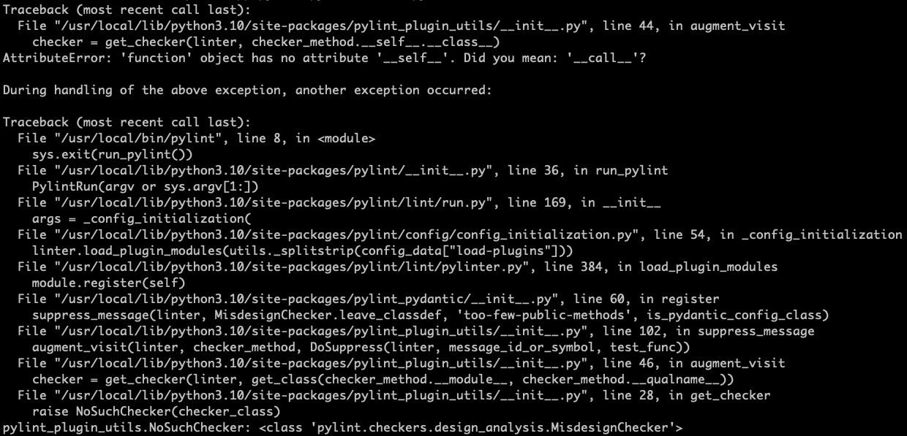

# pylint-pydantic-test

It is uesd to reproduce the problem, when `aws-cron-expression-validator` package works with `pylint-pydantic`.

It will raise the error in docker environment.

## How to reproduce it?

1. Clone this repo
2. Build docker image `docker build -t pylint-pydantic-test .`
3. Run pylint in docker container `docker run --rm pylint-pydantic-test pylint`

If I remove `aws-cron-expression-validator` package in poetry, it will work well.
